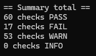
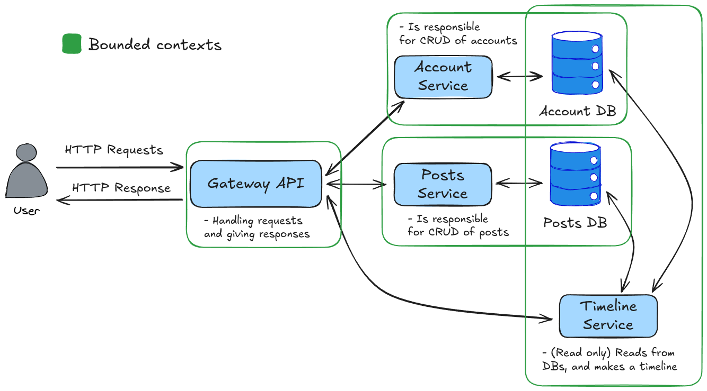

# Compulsory Assignment 2
<p align="center">
  
</p>  

## GatewayAPI
Since we already had implemented an GatewayAPI in the earlier version, we have not re-implemented it.  
The Gateway fullfills all requirements. 

## Reliability

### T1: Points of Failure
- Network: Services and the databases rely on network connections to communicate. Docker Compose mitigates some issues, but ensuring container uptime is very important.
- Data Storage: If databases go down (unavailable) dependent services also go down. The current system lacks failure handling.
- Service Dependency: Failures and/or slow responses impact the system directly - there is no mitigation.
- Strategy: Ensure container uptime, mitigate database issues, and manage service dependencies.

### Proposed Strategy
- Network: Use replicas, DNS routing, and retry mechanisms.
- Data Storage: Add caching and a backup database.
- Service Dependency: Scale system with replicas.

### T2: Implementation Plan
| Component         | Plan                                      | Implementation Status       |
|-------------------|-------------------------------------------|-----------------------------|
| **Network**       | Plan for replicas and DNS routing         | Implemented                 |
| **Data Storage**  | Plan for caching and a backup database    | Not yet implemented         |
| **Service Dependency** | Retry mechanism added for GatewayAPI | Implemented                 |

## Kubernetes

## Deployment with Kubernetes
Before doing anything else, please run this CLI command to install nginx ingress controller:
```
kubectl apply -f https://raw.githubusercontent.com/kubernetes/ingress-nginx/main/deploy/static/provider/cloud/deploy.yaml
```

We have divided our manifest files into 7 files because kubernetes uses these types and for modularity. Run in order - to setup!
| Order | YAML File          | Command                           | Description |
|------|--------------------|-----------------------------------|--------------|
| 1    | namespace.yaml     | `kubectl apply -f namespace.yaml` | Namespace of the containers. |
| 2    | db-secret.yaml     | `kubectl apply -f db-secret.yaml` | Secret store of k8s Cluster. |
| 3    | pvc.yaml           | `kubectl apply -f pvc.yaml`       | Claims 2x1Gi of storage space. | 
| 4    | statefulsets.yaml  | `kubectl apply -f statefulsets.yaml` | Database StatefulSet Pods with PVC. | 
| 5    | services.yaml      | `kubectl apply -f services.yaml`  | All services as pods. |
| 6    | deployments.yaml   | `kubectl apply -f deployments.yaml` | Deployment of pods with replicas. |
| 7    | ingress.yaml       | `kubectl apply -f ingress.yaml`   | Nginx ingress to route traffic. |

## Security in Microservices
As a first security messure, the deployment in either docker compose or kubernetes has been isolated from the host network, such that the only way into the system is through the gateway/ingress point.
This effectively avoids the problem of abuse of internal services.  

Addtional messures can be taken such that inter-service communication is secured. In the case of this system, there is no security strengthening in doing so. However we have done it anyway, as it is a requirement for the assignment.  
  
We have implemented:
- a Vault (Hashicorp vault)
- Interservice JWT Authentication
  
The services generate JWT tokens and send them to the vault. The Gateway gets the tokens when communicating with the services.

We found this tool kube-bench ` https://github.com/aquasecurity/kube-bench ` that we used in order to check our cluster / kubernetes setup.  
We think fixing the given issues are outside of the scope of this assignment, but we want to use the result of the kube-bench check, ` job.yaml `, to underline our previous point, our system is adequately secured.  

<p align="center">
  
</p>  

## Design patterns
A sidecar pattern has been implemented in the form of Serilog & Seq logging, that routes all logging from the API gateway into Seq for easy lookup.
Most microservice design patterns found were not applicable.   
For instance service healthy is obsolete as the functionality gained is already avialble through Kubernetes/Docker Compose.  
The Sage pattern is too complex and also unncessary for this system, as we do not deal with complex data transactions.
The Database per Service pattern is partially used, which is fundamental for the Saga pattern, but yet again the Saga pattern is too complex for our needs.  
A self study on design patterns lead us to the conclusion that dependency injection is a design pattern, which we have used.  


# Compulsory Assignment # 1
## Design, Architecture, and Scoping
<p align="center">
  
</p>  

## Deployment using Docker
Deploy as local development environment
`docker compose up -d`

Deploy as production environment
`docker compose up -d -f docker-compose.yml -f docker-production.yml`

### Deployment Plan
As we are using Docker for deployment, the deployment strategy is simple.  
Below is described how to deploy to a production environment.

#### How to deploy on production
1. Clone the repository to the production machine
2. Run the 'Deploy as production environment' command in previous section.
3. Additionally the firewall should be set to allow incoming connections on port `8080`.

#### Security
Using docker as the production environment, there are few security concerns.

For one, the isolation of the containers makes it so, that if one container is breached, 
it is very difficult for the intruders to pivot into other containers, or the host system.  
Spreading from one container to another is further secured by the segmentation of the networks between the containers.
Containers only have access to other required containers.

#### Scalability
To scale the system, we plan to add more gateway, post, account, and timeline services as needed based on bottlenecks.
The posts and accounts databases will be scaled in the form of beefier database servers, also called vertical scaling.
Depending on needs, regional servers could be setup. 
Additionally, segmentation of data accross servers can be implemented.

#### Disaster recovery
Assuming docker is fault-free, the pressing issue is that of faults in the TwitterSystem. 
By always having several instances of the different services running, downtime is minimized.
Systems that are running into faults will be restarted with a clean state to avoid cascading faults.
The databases will be copied to cold storage every 4 hours, so that if a fire breaks out in the datacenter, we still have data security.

## Inter Service Communication
We make use of the HTTP protocol to define an API using an RPC schema. This makes communication simple and straightforward.

It was considered if message queues should be employed, but for the system envisioned it is not fitting as there are no need 
for multiple receivers of the requests within the system. 

Our initial thought was to use an API with an RPC schema. This would create a simple and straightforward communication model. 
After implementation we started discussing, whether or not, we should have used message queues's. 
Our discussion lead us to the following conclusion:  

Using a message queue system could be faster, but also more complicated to setup. However, it would most likely be better for scaling the system, i.e. many microservices. Although, after a certain scaling size, the message queue's would also become a bottle neck.  
The option we went with was to use the internal DNS mapping of services with replicas. This means we have a single gateway that forwards 
traffic to the services which each has multiple replicas.  

To further extend this model, loadbalancers could be added for incoming client requests, and multiple gateway replicas could be used.  
Additionally, loadbalancers for each service would also be required.  

This sure would have been a great discussion to have, before we started implementing and designing. However, circumstances happened.
Going forward, we might change the communication from HTTP RPC API to message queue's.  

If we were to design a twitter clone without having to implement it ourselves, we would have chosen message queue's as our communication channel because it's properties are better suited for very large systems.
